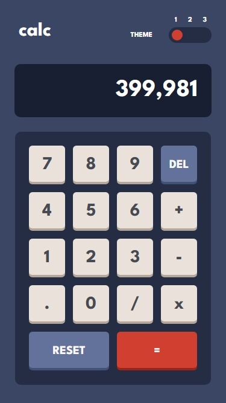
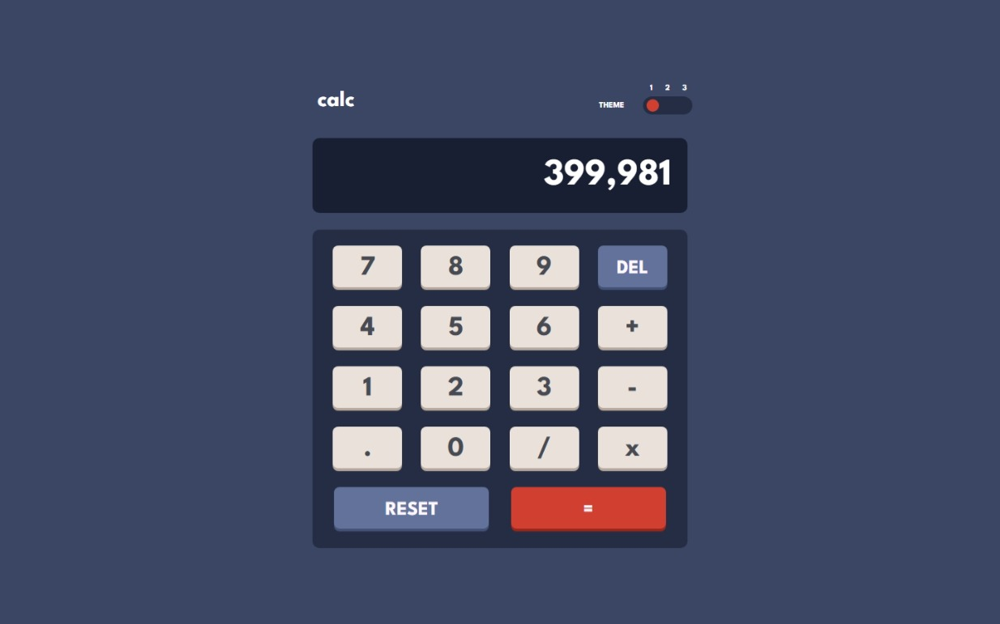

# Frontend Mentor - Calculator App
## Welcome! 👋

Thanks for checking out this front-end coding challenge.

## Building Your Project

Feel free to use any workflow that you're comfortable with. Below is a suggested process, but you don't need to follow these steps exactly:

1. I created a [repository](https://github.com/djenidisimple/calculator-app)
2. You can view the [live demo](https://djenidisimple.github.io/calculator-app/)
3. I worked with the provided JPG design and translated it into Figma to get precise measurements
4. I started with HTML before moving to CSS
5. I downloaded the required font-family from Google Fonts
6. After completing the design, I started with mobile-first approach, then adapted for desktop, and finally added the calculator logic with JavaScript

## Deploying Your Project

I deployed my project using GitHub Pages:

- [GitHub Pages](https://pages.github.com/)

## Result

### Mobile Design

### Desktop Design

